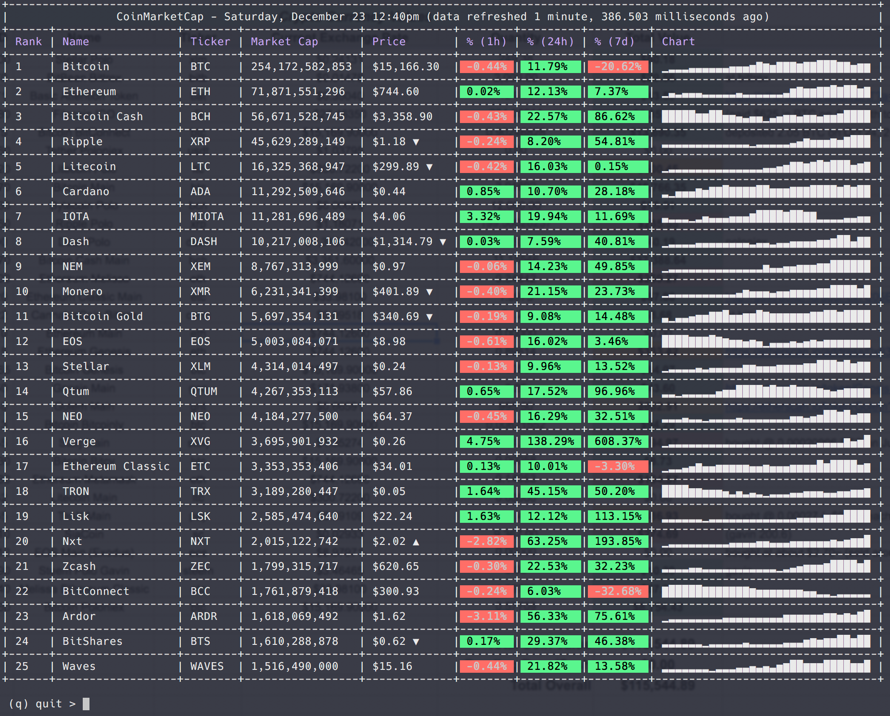

# CoinDashboard

A simple terminal dashboard for crypto currency prices



This was just something quick and dirty I threw together in Elixir and wrapped up using [escript](https://elixirschool.com/en/lessons/advanced/escripts/) - so you will need Erlang installed at least before running.

Data is provided using the [coinmarketcap](https://coinmarketcap.com/) API.

## Setup

Be sure that `~/.mix/escripts` is in your path by setting it in your .bash_profile, .zshrc, etc.

_Don't forget to re-source your terminal or open a new terminal window._


#### Bash
```
echo 'export PATH="$HOME/.mix/escripts:$PATH"'  >> ~/.bash_profile
```

#### ZSH
```
echo 'export PATH="$HOME/.mix/escripts:$PATH"'  >> ~/.zshrc
```

### Install Escript

Install the escript by running `mix escript.install github amokan/coin_dashboard`

## Usage

Just run `coin_dashboard` in the terminal.

Note that historical data used to generate sparklines will slowly update over time. The system will persist this data in a local ETS table saved to `~/.coin_dashboard/historical_data.tab`.

## Elixir/Erlang

This assumes you have Erlang installed on your system. If running mac and are using homebrew, a simple `brew install erlang` will get you going. If you want to make any changes, you'll need Elixir installed - `brew install elixir`
